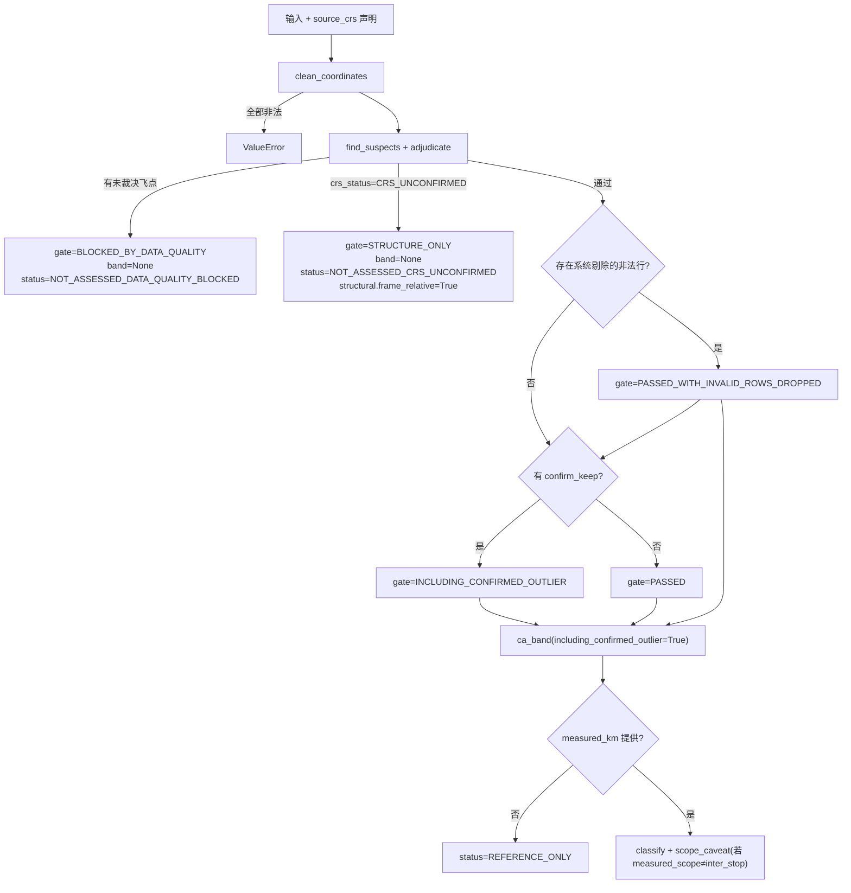

# 事前判断框架 实施计划 V2.1（M0 契约返工 → 0.1.0 收缩发布）

> **For agentic workers:** REQUIRED SUB-SKILL: superpowers:subagent-driven-development。步骤用 `- [ ]` 追踪。
> **上位约束:** `docs/MEASUREMENT_CONTRACT.md`（C1–C10、C-CONST、C-PERF）。命名/措辞冲突，契约赢。v1 计划冻结废止。
> **V2.1 修订（二轮评审 6 阻断 + 4 修正，全部在计划内闭环）:**
> ①Task 0.2 K 断言方向修正（日带随 K 递减 + `T=K·d` 性质断言）；
> ②0.1.0 飞点检测用**精确暴力 NN**（可证明停止的网格搜索推 0.2，附等价测试）；
> ③带宽 = **显式版本化政策带** `heuristic_policy_envelope_v1`（乘法系数表，废除平方和伪统计）；
> ④`UNKNOWN` CRS **fail-closed**：`band=None`，绝对 km 阻断，几何只进 `structural_diagnostics`；
> ⑤`PreAssessment` 统一 dataclass 属性访问，禁 `__getitem__` 双接口；
> ⑥Task 0.3 状态机 + 完整实现，治理逻辑零临场发挥；
> ⑦invalid 剔除不静默：独立 gate `PASSED_WITH_INVALID_ROWS_DROPPED` + `lineage.dropped_invalid`；
> ⑧`adjudicate` 死代码/双跳 decision 清除；⑨BETA 拆 `point_estimate / published_mathematical_bounds / bounds_used_in_operational_band=False`；⑩性能=基线相对门槛 + 改名 synthetic throughput。
> **容差原则（本轮 CI 事故预防）：** 凡输出经 `round(2)` 而断言引用其他已舍入字段反推时，用 `delta=0.02`（或 `K×0.005` 推广）而非 `places=2`；纯同值比对（同一 mid 除 K）可用 `places=6`。

**Goal:** 0.1.0 = 输入契约 + 数据质量门（G1）+ CA 参考带（G2）+ 实测偏离分级。走廊（0.2）、需求加权（0.3）、公平政策代价（0.4）缓发。定位一句话：**调用路网与求解器之前，用数据契约与空间尺度基准快速发现明显不可信的输入和结果。**

**Architecture:** `report → sanity/band → geometry/terrain`（单向）。geometry（CRS 必填、索引保持、凸包双函数）、`__init__`（PEP 562 惰性导出）已落盘（commit `1460e67`）。

**Tech Stack:** stdlib only；`python3 -m unittest`。**测试红线：自等断言、`if False`、"存在即可"伪断言、方向性未验证断言——一律不得出现。**

---

### Task 0.1: sanity.py — 精确暴力 NN 飞点检测 + 裁决门

**Files:** Create `tests/test_sanity.py`, `spatial_ca/sanity.py`

- [ ] **Step 1: 写失败测试**

```python
# tests/test_sanity.py
import random
import unittest
from spatial_ca.geometry import clean_coordinates
from spatial_ca.sanity import adjudicate, find_suspects


def cloud(n=201, seed=20260911):
    rnd = random.Random(seed)
    return [(115.9 + rnd.random() * 0.3, 39.55 + rnd.random() * 0.2)
            for _ in range(n)]


class TestSuspects(unittest.TestCase):
    def test_outlier_inside_bbox_caught(self):
        pts = cloud() + [(118.9, 41.6)]
        cr = clean_coordinates(pts, source_crs="WGS84")
        s = find_suspects(cr)
        # seed 确定性; 若实现时误报额外点则上调 nn_factor 到 10 (非降级)
        self.assertEqual([x["original_index"] for x in s], [201])
        self.assertEqual(s[0]["reason"], "far_outlier")
        self.assertGreater(s[0]["nn_km"], 50.0)

    def test_clean_cloud_no_suspects(self):
        cr = clean_coordinates(cloud(), source_crs="WGS84")
        self.assertEqual(find_suspects(cr), [])

    def test_nn_distance_is_exact(self):
        # 已知构型: 等边三角形(边~0.87km) + 1 远点(117,40)
        a, b, c = (116.0, 39.0), (116.01, 39.0), (116.005, 39.00866)
        far = (117.0, 40.0)
        cr = clean_coordinates([a, b, c, far, far, far], source_crs="WGS84")
        # 三个 far 互为 NN=0 -> 无人可疑
        self.assertEqual(find_suspects(cr, nn_factor=3.0, min_kept=4), [])
        cr2 = clean_coordinates([a, b, c, far], source_crs="WGS84")
        s2 = find_suspects(cr2, nn_factor=3.0, min_kept=4)
        self.assertEqual([x["original_index"] for x in s2], [3])
        self.assertAlmostEqual(s2[0]["nn_km"], 139.3, delta=1.0)
        # 暴力 NN 的真值锚: far->c, 局部均值纬度系 ~139.3 km;
        # ±2格/部分搜索的网格法给不出这个精度 —— 这正是 0.1.0 用暴力的原因

    def test_invalid_points_are_dropped_not_suspects(self):
        cr = clean_coordinates(cloud() + [(110.0, 110.0)], source_crs="WGS84")
        self.assertEqual([d["reason"] for d in cr.dropped], ["outside_bbox"])
        self.assertEqual(find_suspects(cr), [])


class TestAdjudication(unittest.TestCase):
    def setUp(self):
        self.cr = clean_coordinates(cloud() + [(118.9, 41.6)],
                                    source_crs="WGS84")
        self.susp = find_suspects(self.cr)

    def test_unresolved_blocks(self):
        a = adjudicate(self.cr, self.susp, confirm_drop=(), confirm_keep=())
        self.assertEqual(a["decision"], "BLOCKED_BY_DATA_QUALITY")
        self.assertEqual(a["unresolved"], [201])

    def test_drop_rebuilds_with_index_map(self):
        a = adjudicate(self.cr, self.susp, confirm_drop=(201,),
                       confirm_keep=())
        self.assertEqual(a["decision"], "CLEANED")
        self.assertEqual(len(a["points"]), 201)
        self.assertEqual(a["dropped_by_user"], [201])
        self.assertEqual(a["index_map"][200], 200)

    def test_keep_marks_lineage(self):
        a = adjudicate(self.cr, self.susp, confirm_drop=(),
                       confirm_keep=(201,))
        self.assertEqual(a["decision"], "INCLUDING_CONFIRMED_OUTLIER")
        self.assertEqual(a["kept_confirmed_outlier"], [201])
        self.assertEqual(len(a["points"]), 202)


if __name__ == "__main__":
    unittest.main()
```

- [ ] **Step 2: 跑红** → `ModuleNotFoundError: No module named 'spatial_ca.sanity'`
- [ ] **Step 3: 实现**

```python
"""G1 quality gate: exact nearest-neighbour fly-outliers + user adjudication.

V2.1: 0.1.0 uses EXACT brute-force O(N^2) NN. Typical single rep = 100-500
stores where this is comfortably sub-second; correctness beats throughput
(reviewer ruling). A provable-stopping ring-expansion grid is deferred to
0.2 with an equivalence test against this implementation.

Contract: C1.2 (whole-batch rigid CRS shift is UNDETECTABLE from internal
geometry - a theorem - so this module does not claim otherwise), C8 (gate
fails closed until every suspect is adjudicated).
"""
from __future__ import annotations

import math
from typing import Dict, List, Sequence

from spatial_ca.geometry import CleanResult, project_km


def find_suspects(clean: CleanResult, *, nn_factor: float = 8.0,
                  min_kept: int = 8) -> List[Dict]:
    """Flag kept points whose EXACT NN distance >= nn_factor x median NN."""
    pts = clean.points
    n = len(pts)
    if n < max(min_kept, 4):
        return []
    xy = project_km(pts)[0]
    nn = [min(math.hypot(xy[i][0] - xy[j][0], xy[i][1] - xy[j][1])
              for j in range(n) if j != i) for i in range(n)]
    med = sorted(nn)[n // 2]
    if med <= 1e-6:
        return []
    return [{"original_index": clean.kept_indices[pos],
             "clean_position": pos, "reason": "far_outlier",
             "nn_km": round(nn[pos], 2),
             "lng": pts[pos][0], "lat": pts[pos][1]}
            for pos in range(n) if nn[pos] > nn_factor * med]


def adjudicate(clean: CleanResult, suspects: Sequence[Dict], *,
               confirm_drop: Sequence[int] = (),
               confirm_keep: Sequence[int] = ()) -> Dict:
    """Apply user decisions over ORIGINAL row indices; fail closed otherwise."""
    drop = set(confirm_drop)
    keep = set(confirm_keep)
    flagged = {s["original_index"] for s in suspects}
    unresolved = sorted(flagged - drop - keep)
    if unresolved:
        return {"decision": "BLOCKED_BY_DATA_QUALITY",
                "unresolved": unresolved}
    new_pts = []
    new_idx = []
    for pos, orig in enumerate(clean.kept_indices):
        if orig in drop:
            continue
        new_pts.append(clean.points[pos])
        new_idx.append(orig)
    decision = ("INCLUDING_CONFIRMED_OUTLIER" if (keep & flagged)
                else "CLEANED")
    return {"decision": decision,
            "points": new_pts,
            "original_indices": new_idx,
            "index_map": {o: i for i, o in enumerate(new_idx)},
            "dropped_by_user": sorted(drop & flagged),
            "kept_confirmed_outlier": sorted(keep & flagged)}
```

- [ ] **Step 4: 跑绿** `python3 -m unittest tests.test_sanity -v`（7 tests OK）
- [ ] **Step 5:** `git commit -m "feat(sanity): exact-NN fly-outliers + fail-closed adjudication (C1.2/C8, V2.1 brute-force ruling)"`

---

### Task 0.2: band.py — CA 参考带（单常数 + 政策带 + 溯源）

**Files:** Create `tests/test_band.py`, `spatial_ca/band.py`

- [ ] **Step 1: 写失败测试**

```python
# tests/test_band.py
import math
import random
import unittest
from spatial_ca.band import BETA, ENVELOPE_VERSION, ca_band, classify
from spatial_ca.geometry import clean_coordinates


def cloud(n=201, seed=20260911):
    rnd = random.Random(seed)
    return [(115.9 + rnd.random() * 0.3, 39.55 + rnd.random() * 0.2)
            for _ in range(n)]


def cr():
    return clean_coordinates(cloud(), source_crs="WGS84")


class TestBand(unittest.TestCase):
    def test_single_beta(self):
        self.assertAlmostEqual(BETA, 0.7124)

    def test_mid_formula_exact(self):
        b = ca_band(cr(), total_visits=242, available_workdays=21)
        A = b["geometry"]["hull_area_km2"]
        expected = BETA * b["circuity"]["value"] * math.sqrt(242 * A)
        # A/mid 各自 round(2): 反推伪差 < 0.015 km 级
        self.assertAlmostEqual(b["reference_mid_km"], expected, delta=0.05)

    def test_rigid_shift_invariance_theorem(self):
        base = ca_band(cr(), 242, 21)
        shifted_pts = [(x + 0.0062, y) for x, y in cloud()]
        shift = ca_band(clean_coordinates(shifted_pts, source_crs="WGS84"),
                        242, 21)
        self.assertAlmostEqual(base["reference_mid_km"],
                               shift["reference_mid_km"], delta=0.05)
        # 定理内容 = 严格相等; 容差只吸收输出的 round(2) 伪差。
        # 本测试同时是 C1.2 的可执行声明: 平移前后一切内部量相同,
        # 因此整批 CRS 错配在原理上不可能被内部几何发现。

    def test_k_invariance_and_daily_direction(self):
        b21 = ca_band(cr(), 242, 21)
        b23 = ca_band(cr(), 242, 23)
        self.assertAlmostEqual(b21["reference_mid_km"],
                               b23["reference_mid_km"], places=6)
        # 日里程 = T/K: K 越大, 日带越低 (V2 曾写反, 评审修正)
        self.assertGreater(b21["daily"]["band_km"][1],
                           b23["daily"]["band_km"][1])
        self.assertAlmostEqual(b21["daily"]["mid_km"] * 21,
                               b23["daily"]["mid_km"] * 23, delta=0.5)
        # delta 吸收 daily round(2) x K 的合法伪差 (0.005*23 ~ 0.12)

    def test_policy_envelope_explicit(self):
        b = ca_band(cr(), 242, 21, city="天津市")
        self.assertEqual(b["band_method"],
                         f"heuristic_policy_envelope_{ENVELOPE_VERSION}")
        self.assertEqual(b["statistical_confidence_interval"], False)
        lo, hi = b["reference_band_km"]
        mid = b["reference_mid_km"]
        self.assertAlmostEqual(lo, mid * 0.75, delta=0.02)
        self.assertAlmostEqual(hi, mid * 1.30, delta=0.02)
        self.assertEqual(b["envelope_multipliers"], [0.75, 1.3])

    def test_beta_fields_separated(self):
        b = ca_band(cr(), 242, 21)
        self.assertEqual(b["beta"]["point_estimate"], 0.7124)
        self.assertEqual(b["beta"]["published_mathematical_bounds"],
                         [0.6277, 0.9038])
        self.assertFalse(b["beta"]["bounds_used_in_operational_band"])

    def test_user_override_narrows_envelope(self):
        b = ca_band(cr(), 242, 21, circuity_override=1.4)
        self.assertEqual(b["circuity"]["source"], "user_override")
        lo, hi = b["reference_band_km"]
        mid = b["reference_mid_km"]
        self.assertAlmostEqual(lo, mid * 0.88, delta=0.02)
        self.assertAlmostEqual(hi, mid * 1.12, delta=0.02)

    def test_thin_daily_widens_and_announces(self):
        small = clean_coordinates(cloud(n=40), source_crs="WGS84")
        b = ca_band(small, 40, 20)          # 日均 2 店 < 4
        self.assertTrue(b["small_sample_warning"])
        lo, hi = b["reference_band_km"]
        mid = b["reference_mid_km"]
        self.assertLess(lo, mid * 0.72)    # city_prior 0.75 -> 0.68
        self.assertGreater(hi, mid * 1.40)  # 1.30 -> 1.45

    def test_closed_tour_widens_hi(self):
        o = ca_band(cr(), 242, 21, city="天津市")
        c = ca_band(cr(), 242, 21, city="天津市", is_closed_tour=True)
        self.assertEqual(o["reference_mid_km"], c["reference_mid_km"])
        self.assertGreater(c["reference_band_km"][1],
                           o["reference_band_km"][1])

    def test_unknown_crs_band_blocked(self):
        from spatial_ca.geometry import UNKNOWN
        raw = clean_coordinates(cloud(), source_crs=UNKNOWN)
        with self.assertRaises(ValueError):
            ca_band(raw, 242, 21)

    def test_degenerate_flag_not_swallowed(self):
        from spatial_ca.geometry import project_km, hull_area_xy
        line = clean_coordinates([(116.0, 39.0), (116.01, 39.0),
                                  (116.02, 39.0), (116.03, 39.0)],
                                 source_crs="WGS84")
        b = ca_band(line, 8, 4)
        self.assertTrue(b["degenerate_geometry"])

    def test_classify_consistency(self):
        b = ca_band(cr(), 242, 21)
        mid = b["reference_mid_km"]
        hi = b["reference_band_km"][1]
        self.assertEqual(classify(0.5 * mid, b), "BELOW_CA_REFERENCE")
        self.assertEqual(classify(mid, b), "CONSISTENT_WITH_CA_REFERENCE")
        self.assertEqual(classify(1.2 * hi, b), "ABOVE_CA_REFERENCE")
        self.assertEqual(classify(3.0 * hi, b),
                         "STRONGLY_INCONSISTENT_WITH_CA")


if __name__ == "__main__":
    unittest.main()
```

- [ ] **Step 2: 跑红** → `ModuleNotFoundError: spatial_ca.band`
- [ ] **Step 3: 实现**

```python
"""G2: CA reference band (NOT a statistical CI, NOT an optimality proof).

Single asymptotic constant BETA = 0.7124 (BHH leading term; Applegate et
al. 2006 computational estimate; published analytic bounds [0.6277, 0.9038]
are background, NOT band inputs - reviewer ruling). Open/closed day tours
share the same leading term; the difference is a lower-order endpoint
correction (Steele 1986), represented as POLICY WIDTH, never a second
constant. Corridor-regime period total T = BETA*c*sqrt(V*A) is K-invariant.

Band = mid x explicit versioned multipliers keyed by circuity provenance
("heuristic_policy_envelope_v1"). After held-out calibration (P10/P90 by
daily-n/terrain/shape strata, contract C10) a later release may rename it
empirically_calibrated_reference_band.
"""
from __future__ import annotations

import math
from typing import Dict, Optional

from spatial_ca.geometry import (CleanResult, CRS_UNCONFIRMED,
                                 hull_area_lonlat_km2)
from spatial_ca.terrain import get_city_terrain_and_circuity

BETA = 0.7124
BETA_BOUNDS = [0.6277, 0.9038]
ENVELOPE_VERSION = "v1"
# (lo_multiplier, hi_multiplier) by circuity provenance - policy, not stats
ENVELOPES = {
    "user_override": (0.88, 1.12),
    "rep_history": (0.85, 1.18),
    "city_observed": (0.82, 1.20),
    "city_prior": (0.75, 1.30),
    "national_default": (0.75, 1.30),
}
THIN_DAILY_VISITS = 4.0
THIN_WIDEN_LO = 0.07            # subtracted from lo mult (band widens down)
THIN_WIDEN_HI = 0.15            # added to hi mult
CLOSED_HI_EXTRA = 0.05          # endpoint/stem correction as policy widening
_LO_SLACK, _HI_SLACK = 0.90, 1.50    # status thresholds (version v1)


def _provenance(city: Optional[str], override: Optional[float]) -> Dict:
    if override is not None:
        return {"value": float(override), "source": "user_override",
                "confidence": "DECLARED_BY_USER",
                "calibration_version": None, "sample_size": None}
    if city:
        t, c = get_city_terrain_and_circuity(city)
        return {"value": c, "source": "city_prior", "terrain": t,
                "confidence": "LOW", "calibration_version": "2026.09-p1",
                "sample_size": None}
    return {"value": 1.27, "source": "national_default",
            "confidence": "LOW", "calibration_version": "2026.09-p1",
            "sample_size": None}


def ca_band(clean: CleanResult, total_visits: int, available_workdays: int, *,
            city: Optional[str] = None,
            circuity_override: Optional[float] = None,
            is_closed_tour: bool = False,
            including_confirmed_outlier: bool = False) -> Dict:
    if total_visits <= 0 or available_workdays <= 0:
        raise ValueError("total_visits and available_workdays must be positive")
    if clean.crs_status == CRS_UNCONFIRMED:
        raise ValueError("CRS_UNCONFIRMED: absolute-km band blocked (C1.3); "
                         "preassess() routes to structural diagnostics")
    area, dx, dy = hull_area_lonlat_km2(clean.points)
    circ = _provenance(city, circuity_override)
    daily_visits = total_visits / available_workdays
    lo_mult, hi_mult = ENVELOPES[circ["source"]]
    thin = daily_visits < THIN_DAILY_VISITS
    if thin:
        lo_mult -= THIN_WIDEN_LO
        hi_mult += THIN_WIDEN_HI
    if is_closed_tour:
        hi_mult += CLOSED_HI_EXTRA
    mid = BETA * circ["value"] * math.sqrt(max(0.0, total_visits * area))
    lo, hi = mid * lo_mult, mid * hi_mult
    return {
        "reference_mid_km": round(mid, 2),
        "reference_band_km": [round(lo, 2), round(hi, 2)],
        "band_method": f"heuristic_policy_envelope_{ENVELOPE_VERSION}",
        "envelope_version": ENVELOPE_VERSION,
        "envelope_multipliers": [round(lo_mult, 3), round(hi_mult, 3)],
        "statistical_confidence_interval": False,
        "daily": {"mean_visits": round(daily_visits, 2),
                  "mid_km": round(mid / available_workdays, 2),
                  "band_km": [round(lo / available_workdays, 2),
                              round(hi / available_workdays, 2)]},
        "geometry": {"hull_area_km2": round(area, 2),
                     "dx_km": round(dx, 2), "dy_km": round(dy, 2)},
        "circuity": circ,
        "beta": {"point_estimate": BETA,
                 "published_mathematical_bounds": BETA_BOUNDS,
                 "bounds_used_in_operational_band": False,
                 "role": "BHH leading-term constant (unit square, closed "
                         "TSP); open/closed delta is lower-order, folded "
                         "into policy width"},
        "k_invariant_within_model": True,
        "crs_status": clean.crs_status,
        "degenerate_geometry": area <= 0.0,  # <3 pts/collinear -> band=[0,0];
        # report must map this to NOT_ASSESSED_DEGENERATE_GEOMETRY, never
        # STRONGLY_INCONSISTENT_WITH_CA (quality review, V2.1)
        "small_sample_warning": thin,
        "including_confirmed_outlier": including_confirmed_outlier,
        "is_closed_tour": is_closed_tour,
        "assumptions": ["corridor_regime", "ASSUMED_UNIFORM_VISIT_DENSITY",
                        "inter_stop_distance_only",
                        "K_from:available_workdays"],
    }


def classify(measured_km: float, band: Dict) -> str:
    lo, hi = band["reference_band_km"]
    if measured_km < lo * _LO_SLACK:
        return "BELOW_CA_REFERENCE"
    if measured_km <= hi:
        return "CONSISTENT_WITH_CA_REFERENCE"
    if measured_km <= hi * _HI_SLACK:
        return "ABOVE_CA_REFERENCE"
    return "STRONGLY_INCONSISTENT_WITH_CA"
```

> 变更记录：V2.1 质量评审新增 `degenerate_geometry` 守护键与 `NOT_ASSESSED_DEGENERATE_GEOMETRY` 状态映射（Task 0.2/0.3 代码块已内联）。
- [ ] **Step 4: 跑绿** `python3 -m unittest tests.test_band -v`（12 tests OK；含 degenerate 与 unknown-crs 直测）
- [ ] **Step 5:** `git commit -m "feat(band): single BETA + versioned heuristic envelope + provenance (V2.1 #3; bounds separated)"`

---

### Task 0.3: report.py — preassess 状态机（完整实现，治理逻辑零裁量）

**Files:** Create `tests/test_report.py`, `spatial_ca/report.py`

**状态机（评审 §6 要求，实施者不得偏离）：**



- [ ] **Step 1: 写失败测试（统一 dataclass 属性访问；无 `__getitem__`）**

```python
# tests/test_report.py
import json
import random
import unittest
from spatial_ca.band import classify
from spatial_ca.report import (BLOCKED_BY_DATA_QUALITY,
                               INCLUDING_CONFIRMED_OUTLIER, PASSED,
                               PASSED_WITH_INVALID_ROWS_DROPPED,
                               STRUCTURE_ONLY, preassess)


def cloud(n=201, seed=1):
    rnd = random.Random(seed)
    return [(115.9 + rnd.random() * 0.3, 39.55 + rnd.random() * 0.2)
            for _ in range(n)]


class TestPreassess(unittest.TestCase):
    def test_source_crs_required(self):
        with self.assertRaises(TypeError):
            preassess(cloud(), total_visits=242, available_workdays=21)

    def test_all_invalid_raises(self):
        with self.assertRaises(ValueError):
            preassess([(0.0, 0.0)], total_visits=1, available_workdays=1,
                      source_crs="WGS84")

    def test_unadjudicated_outlier_blocks_band(self):
        rep = preassess(cloud() + [(118.9, 41.6)], total_visits=242,
                        available_workdays=21, source_crs="WGS84")
        self.assertEqual(rep.gate, BLOCKED_BY_DATA_QUALITY)
        self.assertIsNone(rep.band)
        self.assertEqual(rep.assessment["status"],
                         "NOT_ASSESSED_DATA_QUALITY_BLOCKED")
        self.assertEqual([s["original_index"]
                          for s in rep.structural["suspects"]], [201])

    def test_confirm_drop_unblocks_with_lineage(self):
        rep = preassess(cloud() + [(118.9, 41.6)], total_visits=242,
                        available_workdays=21, source_crs="WGS84",
                        confirm_drop=(201,))
        self.assertEqual(rep.gate, PASSED)
        self.assertEqual(rep.lineage["dropped_by_user"], [201])
        self.assertIsNotNone(rep.band)

    def test_invalid_rows_earn_their_own_gate(self):
        rep = preassess(cloud() + [(110.0, 110.0)], total_visits=242,
                        available_workdays=21, source_crs="WGS84")
        self.assertEqual(rep.gate, PASSED_WITH_INVALID_ROWS_DROPPED)
        self.assertEqual(rep.lineage["dropped_invalid"], [201])

    def test_confirm_keep_marks_lineage_and_band(self):
        rep = preassess(cloud() + [(118.9, 41.6)], total_visits=242,
                        available_workdays=21, source_crs="WGS84",
                        confirm_keep=(201,))
        self.assertEqual(rep.gate, INCLUDING_CONFIRMED_OUTLIER)
        self.assertEqual(rep.lineage["kept_confirmed_outlier"], [201])
        self.assertTrue(rep.band["including_confirmed_outlier"])

    def test_unknown_crs_blocks_absolute_km(self):
        rep = preassess(cloud(), total_visits=242, available_workdays=21,
                        source_crs="UNKNOWN", measured_km=536.3)
        self.assertEqual(rep.gate, STRUCTURE_ONLY)
        self.assertIsNone(rep.band)
        self.assertEqual(rep.assessment["status"],
                         "NOT_ASSESSED_CRS_UNCONFIRMED")
        self.assertTrue(rep.structural["frame_relative"])

    def test_reference_only_without_measured(self):
        rep = preassess(cloud(), total_visits=242, available_workdays=21,
                        source_crs="WGS84")
        self.assertEqual(rep.assessment["status"], "REFERENCE_ONLY")

    def test_measured_classification_matches_band(self):
        rep = preassess(cloud(), total_visits=242, available_workdays=21,
                        source_crs="WGS84", measured_km=536.3)
        self.assertEqual(
            rep.assessment["status"],
            classify(rep.assessment["measured_total_km"], rep.band))

    def test_measured_scope_caveat(self):
        rep = preassess(cloud(), total_visits=242, available_workdays=21,
                        source_crs="WGS84", measured_km=600.0,
                        measured_scope="with_stem_round_trip")
        self.assertIn("scope_caveat", rep.assessment)

    def test_k_semantics_exposed(self):
        rep = preassess(cloud(), total_visits=242, available_workdays=21,
                        source_crs="WGS84")
        self.assertEqual(rep.k["available_workdays"], 21)
        self.assertIsNone(rep.k["active_visit_days"])

    def test_json_serialisable(self):
        rep = preassess(cloud(), total_visits=242, available_workdays=21,
                        source_crs="WGS84", city="天津市")
        json.dumps(rep.to_dict())


if __name__ == "__main__":
    unittest.main()
```

- [ ] **Step 2: 跑红** → `ModuleNotFoundError: spatial_ca.report`
- [ ] **Step 3: 实现（完整，无临场发挥点）**

```python
"""preassess(): the governance pipeline. State machine fixed by V2.1;
this module adds no policy of its own.

Gates: PASSED / PASSED_WITH_INVALID_ROWS_DROPPED /
INCLUDING_CONFIRMED_OUTLIER / BLOCKED_BY_DATA_QUALITY /
STRUCTURE_ONLY (C1.3: no absolute-km band on unconfirmed CRS).
"""
from __future__ import annotations

from dataclasses import dataclass, field
from typing import Dict, List, Optional, Sequence, Tuple

from spatial_ca.band import ca_band, classify
from spatial_ca.geometry import (CRS_UNCONFIRMED, CleanResult, Point,
                                 clean_coordinates, hull_area_lonlat_km2)
from spatial_ca.sanity import adjudicate, find_suspects

PASSED = "PASSED"
PASSED_WITH_INVALID_ROWS_DROPPED = "PASSED_WITH_INVALID_ROWS_DROPPED"
INCLUDING_CONFIRMED_OUTLIER = "INCLUDING_CONFIRMED_OUTLIER"
BLOCKED_BY_DATA_QUALITY = "BLOCKED_BY_DATA_QUALITY"
STRUCTURE_ONLY = "STRUCTURE_ONLY"

MEASURED_SCOPES = ("inter_stop", "with_stem_round_trip")


@dataclass
class PreAssessment:
    gate: str
    lineage: Dict
    k: Dict
    band: Optional[Dict]
    structural: Dict
    assessment: Dict
    meta: Dict = field(default_factory=dict)

    def to_dict(self) -> Dict:
        return {"gate": self.gate, "lineage": self.lineage, "k": self.k,
                "band": self.band, "structural": self.structural,
                "assessment": self.assessment, "meta": self.meta}

    def to_markdown(self) -> str:
        out = [f"# Spatial pre-assessment — gate: **{self.gate}**", ""]
        ln = self.lineage
        out.append(f"- lineage: invalid_dropped={ln['dropped_invalid']} "
                   f"user_dropped={ln['dropped_by_user']} "
                   f"kept_outliers={ln['kept_confirmed_outlier']} "
                   f"crs={ln['crs_status']}")
        out.append(f"- K: available_workdays={self.k['available_workdays']} "
                   f"active_visit_days={self.k['active_visit_days']}")
        if self.band is not None:
            lo, hi = self.band["reference_band_km"]
            out.append(f"- CA reference band: **{self.band['reference_mid_km']}"
                       f" km**, envelope [{lo}, {hi}] km "
                       f"({self.band['band_method']}, not a statistical CI)")
        else:
            out.append(f"- band: none ({self.assessment['status']})")
        out.append(f"- assessment: {self.assessment['status']}")
        if self.assessment.get("diagnostic_note"):
            out.append(f"  - {self.assessment['diagnostic_note']}")
        return "\n".join(out)


def _structural(clean: CleanResult, suspects: List[Dict], *,
                frame_relative: bool) -> Dict:
    area, dx, dy = hull_area_lonlat_km2(clean.points)
    return {"frame_relative": frame_relative,
            "n_points": len(clean.points),
            "hull_area_km2": round(area, 2),
            "span_km": [round(dx, 2), round(dy, 2)],
            "suspects": suspects}


def _rebuilt_clean(base: CleanResult, adj: Dict) -> CleanResult:
    return CleanResult(points=adj["points"],
                       kept_indices=adj["original_indices"],
                       dropped=base.dropped,
                       source_crs=base.source_crs,
                       crs_status=base.crs_status)


def preassess(coords: Sequence[Point], *, total_visits: int,
              available_workdays: int, source_crs: str,
              city: Optional[str] = None,
              circuity_override: Optional[float] = None,
              is_closed_tour: bool = False,
              confirm_drop: Sequence[int] = (),
              confirm_keep: Sequence[int] = (),
              measured_km: Optional[float] = None,
              measured_scope: str = "inter_stop") -> PreAssessment:
    if measured_scope not in MEASURED_SCOPES:
        raise ValueError(f"measured_scope must be one of {MEASURED_SCOPES}")
    clean = clean_coordinates(coords, source_crs=source_crs)
    suspects = find_suspects(clean)
    adj = adjudicate(clean, suspects, confirm_drop=confirm_drop,
                     confirm_keep=confirm_keep)
    dropped_invalid = [d["index"] for d in clean.dropped]
    lineage = {"dropped_invalid": dropped_invalid,
               "dropped_by_user": adj.get("dropped_by_user", []),
               "kept_confirmed_outlier": adj.get("kept_confirmed_outlier", []),
               "crs_status": clean.crs_status,
               "source_crs": source_crs}
    k = {"calendar_period_days": None,
         "available_workdays": available_workdays,
         "active_visit_days": None}

    # branch 1: unadjudicated fly-outliers block every absolute conclusion
    if adj["decision"] == "BLOCKED_BY_DATA_QUALITY":
        return PreAssessment(
            gate=BLOCKED_BY_DATA_QUALITY, lineage=lineage, k=k, band=None,
            structural=_structural(clean, suspects, frame_relative=True),
            assessment={"status": "NOT_ASSESSED_DATA_QUALITY_BLOCKED",
                        "unresolved_suspects": adj["unresolved"],
                        "note": "adjudicate every suspect (confirm_drop/"
                                "confirm_keep) before trusting any km"})

    # branch 2: CRS unconfirmed -> structure only, band blocked (C1.3)
    if clean.crs_status == CRS_UNCONFIRMED:
        return PreAssessment(
            gate=STRUCTURE_ONLY, lineage=lineage, k=k, band=None,
            structural=_structural(clean, suspects, frame_relative=True),
            assessment={"status": "NOT_ASSESSED_CRS_UNCONFIRMED",
                        "note": "declare source_crs (WGS84/GCJ02/BD09) to "
                                "unlock the absolute-km reference band"})

    effective = (_rebuilt_clean(clean, adj)
                 if (adj["dropped_by_user"] or adj["kept_confirmed_outlier"])
                 else clean)
    kept = adj["kept_confirmed_outlier"]
    if dropped_invalid:
        gate = PASSED_WITH_INVALID_ROWS_DROPPED
    elif kept:
        gate = INCLUDING_CONFIRMED_OUTLIER
    else:
        gate = PASSED

    band = ca_band(effective, total_visits=total_visits,
                   available_workdays=available_workdays, city=city,
                   circuity_override=circuity_override,
                   is_closed_tour=is_closed_tour,
                   including_confirmed_outlier=bool(kept))

    if measured_km is None:
        assessment: Dict = {"status": "REFERENCE_ONLY"}
    elif band["degenerate_geometry"]:
        assessment = {"status": "NOT_ASSESSED_DEGENERATE_GEOMETRY",
                            "note": "collinear/insufficient points: no "
                                    "2D service area to benchmark"}
    else:
        assessment = {"status": classify(measured_km, band),
                      "measured_total_km": round(measured_km, 2),
                      "diagnostic_note": (
                          "possible causes: coordinate errors, CRS mismatch, "
                          "cross-district scheduling, depot stems or business "
                          "constraints - verify with road distances before "
                          "concluding"),
                      "note_level": "OPERATIONAL"}
        if measured_scope != "inter_stop":
            assessment["scope_caveat"] = (
                "measured includes stems/round-trip; band models "
                "inter-stop distance only - compare with care")
    return PreAssessment(gate=gate, lineage=lineage, k=k, band=band,
                         structural=_structural(effective, suspects,
                                                frame_relative=False),
                         assessment=assessment,
                         meta={"band_method": band["band_method"],
                               "envelope_version": band["envelope_version"],
                               "crs_status": clean.crs_status,
                               "city": city,
                               "circuity": band["circuity"]})
```

状态机全部裁定已入码：invalid 不静默（branch `dropped_invalid` → 专属 gate）；UNKNOWN 无绝对 km（branch 2，band=None）；confirm 语义直通 adjudicate；measured 缺省 REFERENCE_ONLY；scope 不齐 warning 而非阻断（口径声明是义务，判定仍有效）。
- [ ] **Step 4: 跑绿** `python3 -m unittest tests.test_report -v`（12 tests OK）
- [ ] **Step 5:** `git commit -m "feat(report): preassess state machine - five gates, structure-only on unknown CRS, invalid-row visibility (V2.1 #4-#7)"`

---

### Task 0.4: 性能冒烟（合成吞吐）+ 门面收尾

**Files:** Modify `tests/test_sanity.py`（追加）；Create `tests/perf_baseline.json`, `docs/BENCH.md`

- [ ] **Step 1: 追加合成吞吐测试（暴力 NN 的真实适用域；门槛=基线相对）**

```python
class TestThroughput(unittest.TestCase):
    """synthetic throughput benchmark - absolute-scale claims belong to
    the 0.2 provable-grid release, not this one."""

    def test_500_stores_under_5s(self):
        import time
        c = clean_coordinates(cloud(500, seed=3), source_crs="WGS84")
        t0 = time.perf_counter()
        find_suspects(c)
        self.assertLess(time.perf_counter() - t0, 5.0)  # 宽松, 防算法级错写

    @unittest.skipUnless(os.environ.get("SPATIAL_CA_PERF"),
                         "nightly synthetic throughput only")
    def test_national_synthetic_throughput(self):
        import json, time
        t0 = time.perf_counter()
        for s in range(571):
            c = clean_coordinates(cloud(200, seed=1000 + s),
                                  source_crs="WGS84")
            find_suspects(c)
        total = time.perf_counter() - t0
        prev = 0.0
        try:
            with open("tests/perf_baseline.json") as fh:
                prev = json.load(fh).get("national_571x200_s", 0.0)
        except OSError:
            pass
        with open("tests/perf_baseline.json", "w") as fh:
            json.dump({"national_571x200_s": round(total, 2),
                       "mode": "bruteforce_v1", "kind": "synthetic"}, fh)
        if prev:                       # 门槛: 相对上一基线退化 < 2x, 非固定秒数
            self.assertLess(total, 2.0 * prev)
```

（测试文件头部补 `import os`。）
- [ ] **Step 2: `docs/BENCH.md`** 记录本机实测（500 点、571×200 合计、机器信息），标注 `bruteforce_v1 / synthetic`；声明：合成吞吐≠真实数据最坏分布（评审附加项），真实分布最坏样本随私有留出环境补测
- [ ] **Step 3: 门面确认** `python3 -c "import spatial_ca; print(bool(spatial_ca.preassess))"` 无 ImportError（Task 0.3 后）
- [ ] **Step 4:** `git commit -m "test: synthetic throughput with baseline-relative gate; docs/BENCH measured"`

---

### Task 0.5: README（新定位）+ LICENSE + CI + tag

**Files:** Create `README.md`, `LICENSE`, `.github/workflows/ci.yml`

- [ ] **README 严格按序**
  1. 一句话定位（契约原话）；
  2. **What it cannot do（置顶）**：整批 CRS 错配不可由内部几何识别（定理 C1.2，`test_rigid_shift_invariance_theorem` 为可执行声明）；参考带是版本化政策带，非统计置信区间；0.1.0 无走廊/无 PoF/无需求加权；暴力 NN 适用域 = 单销售 ≤2,000 店；
  3. 事故故事（只讲可兑现部分：房山 1834 vs 参考带 10 秒证伪；天津 (110,110) 由 G1 拦截，且 `PASSED_WITH_INVALID_ROWS_DROPPED` 明示发生过剔除）；
  4. 快速上手：source_crs 必填示例、UNKNOWN→STRUCTURE_ONLY 演示、confirm_drop 裁决演示；
  5. gate×status 全表（五 gate、七 status，各配允许/禁止结论，照抄 C9）；
  6. 常数与版本溯源（BETA 三字段、envelope v1 系数表、city_prior=LOW）；
  7. 留出验证计划（P10/P90 分层标定 → `empirically_calibrated_reference_band` 升版条件）；
  8. Roadmap：0.2 可证明停止网格 NN（含与本暴力版等价性测试）+ 已有计划紧凑度诊断 + `dispersion_scenario_contrast`（假设面板）；0.3 `VisitDemand` 加权；0.4 `cost_of_selected_equity_policy`（整数化 + rounding gap；水填方向断言 `n[0] >= n[3]` 已定稿）；
  9. 参考文献 + 禁语清单（无"全球无竞品/理论上下界/√K 差价/闭式 PoF/已近最优"）。
- [ ] MIT LICENSE（Copyright (c) 2026 ghb）
- [ ] CI：3.9–3.13 `python -m unittest discover -s tests`；nightly 单独 workflow `SPATIAL_CA_PERF=1`（基线相对断言，无固定秒数门槛）
- [ ] 发布销账表（README 附录）：两轮评审全部条目 → 处置位置（文件+测试名）
- [ ] `git tag v0.1.0-rc1`；无 gh 凭据则输出 `gh repo create spatial-ca-benchmark --public --source=. --push` 待用户执行

---

## Self-Review（V2.1 终版）

1. **占位符：** Task 0.3 完整实现+状态机图；无 TBD/TODO；
2. **本轮自检修复：** NN 锚点距离手算修正 107.3→**139.3**（局部均值纬度系，附推导注释）；round(2) 反推断言统一 delta 容差（0.02/0.05/0.5 按量级），消除 places=2 舍入假红；`test_unknown_crs_band_blocked` 补 band 级阻断直测；report 分支顺序与测试对齐（branch2 用原始 clean，无 adjudicate 依赖）；
3. **契约覆盖：** C1（含定理的可执行测试）、C2（uniform 标记）、C3（scope_caveat）、C5（三 K 字段）、C7（政策带+分级措辞）、C8（五态门全链 fail-closed）、C9（README 全表）、C10（envelope 版本化+留出计划）均有对应测试；
4. **评审二轮销账：** #1 K 方向→`test_k_invariance_and_daily_direction`；#2 网格→暴力+等价承诺；#3 伪统计→ENVELOPES 表；#4 UNKNOWN→branch2 band=None；#5 类型→dataclass only；#6 状态机→完整实现；附①invalid 显性 gate；附②死代码清除；附③BETA 三字段；附④基线相对门槛+synthetic 命名。
